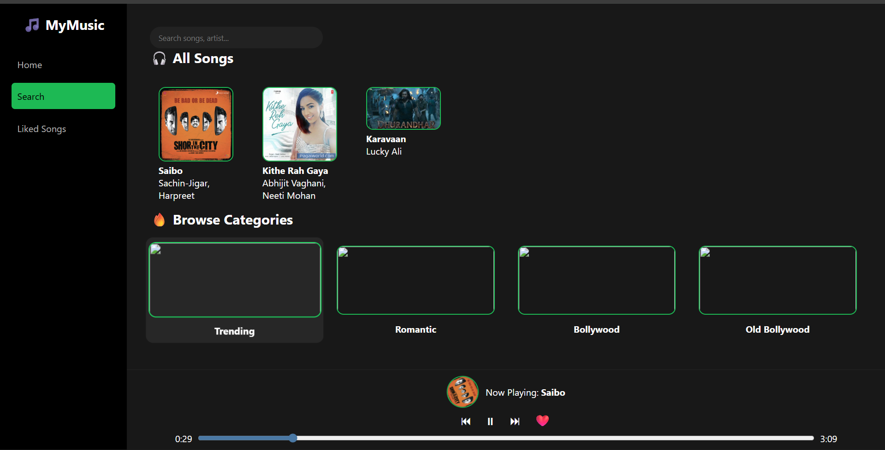

# 🎵 Mini Spotify Clone (Hackathon Project)

## 📑 Table of Contents

* [🌟 Features](#-features)
* [🖼️ Project Preview](#️-project-preview)
* [🧱 Tech Stack](#-tech-stack)
* [📂 Project Structure](#-project-structure)
* [🚀 How to Run the Project](#-how-to-run-the-project)
* [🔑 Important Notes](#-important-notes)
* [🧠 What I Learned](#-what-i-learned)
* [🔮 Future Improvements](#-future-improvements)
* [🙌 Acknowledgements](#-acknowledgements)
* [👤 Author](#-author)

A full‑stack **Mini Spotify‑like music streaming web app** built during a hackathon. The project focuses on core music‑streaming features like song playback, likes, search, genre selection, and responsive UI — while keeping the code simple and beginner‑friendly.

---

## 🌟 Features

### 🎧 Music Player

* Play / Pause songs
* Next & Previous track controls
* Click on any song card to instantly play it
* Persistent player across pages
* Song thumbnail rotation while playing

### ❤️ Likes System

* Like / Unlike songs
* Liked songs stored per user
* Dedicated **Likes Page**
* Search inside liked songs

### 🔍 Search Functionality

* Search by **song title**
* Search by **artist name**
* Works on:

  * Home Page (`index.html`)
  * Likes Page (`likes.html`)
  * Search Page (`search.html`)

### 🎼 Genre Selection

* Multi‑select genre dropdown
* Clean UI with:

  * Black background
  * White text
  * Bold black outline
* Selected genres appear inside placeholder

Available genres:

```
Pop, Romantic, Indie, Acoustic, Love Song,
Soft Rock, Ballad, Chill, Emotional,
Storytelling, Folk, Lo‑Fi
```

### 📊 Song Stats

* Total plays count
* Play count updates correctly without breaking other logic

### 📱 Responsive Design

* Works on different screen sizes
* Sidebar adapts properly
* No content hiding behind navbar

---

## 🖼️ Project Preview

> Example preview image (replace with your own screenshot):

```md

```

Make sure the image exists inside the `assets/` folder.

---

## 🧱 Tech Stack

### Frontend

* HTML5
* CSS3
* JavaScript (Vanilla JS)

### Backend

* Node.js
* Express.js

### Database

* Local JSON / Database (as per implementation)

---

## 📂 Project Structure

```
mini_spotify/
│
├── frontend/
│   ├── index.html
│   ├── likes.html
│   ├── search.html
│   ├── css/
│   │   └── style.css
│   └── js/
│       ├── script.js
│       ├── search.js
│       ├── likes.js
│       └── upload.js
│
├── backend/
│   ├── server.js
│   ├── routes/
│   └── uploads/
│
└── README.md
```

---

## 🚀 How to Run the Project

### 1️⃣ Clone the Repository

```bash
git clone https://github.com/your-username/mini-spotify-clone.git
```

### 2️⃣ Install Backend Dependencies

```bash
cd backend
npm install
```

### 3️⃣ Start the Backend Server

```bash
node server.js
```

Server will run on:

```
http://localhost:5000
```

### 4️⃣ Open Frontend

* Open `index.html` using **Live Server** (recommended)
* OR directly open it in your browser

---

## 🔑 Important Notes

* Make sure backend server is running before playing songs
* Audio & image URLs are served from backend
* Search logic is shared across pages safely
* Code is modular to avoid breaking existing functionality

---

## 🧠 What I Learned

* Managing shared JavaScript logic across multiple pages
* Debugging event handling & DOM issues
* Building reusable UI components
* Handling state like likes, plays, and current playlist
* Improving UX without breaking existing features

---

## 🔮 Future Improvements

* User authentication
* Playlist creation
* Shuffle & repeat modes
* Genre‑based filtering
* Waveform visualization
* Deployment on cloud

---

## 🙌 Acknowledgements

* Hackathon mentors & teammates
* Spotify (for UI inspiration)
* Open‑source community

---

## 👤 Author

**Vansh**
Aspiring Full‑Stack Developer & Data Analytics Enthusiast

---

⭐ If you like this project, don’t forget to star the repo!
